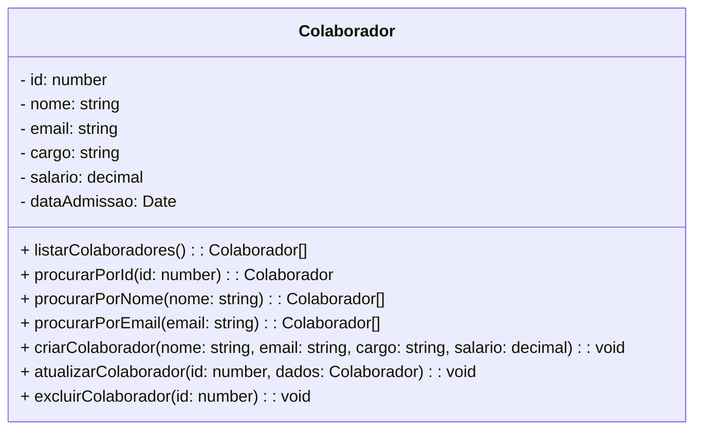

# Sistema de RH - Backend

 

    

  

## 1. Descrição

Sistema de gestão de colaboradores desenvolvido em TypeScript com NestJS
Um sistema de RH é uma plataforma digital que otimiza a gestão de funcionários e processos internos, como recrutamento, benefícios, controle de ponto, desempenho e treinamento, facilitando tarefas administrativas e a comunicação entre equipes.

------

## 2. Sobre esta API

Neste projeto, será desenvolvido um Mínimo Produto Viável (MVP) para um sistema de Recursos Humanos (RH), com a implementação completa das operações CRUD (Create, Read, Update, Delete) para os principais registros e funcionalidades essenciais de um sistema de gestão de RH.

### 2.1. Principais Funcionalidades

1. Cadastrar Colaboradores (Criar) : Adicionar novos colaboradores ao sistema com todas as informações necessárias.
2. Consultar Colaboradores (Ler) : Visualizar os dados cadastrados em uma tabela organizada.
3. Atualizar Colaboradores (Atualização) : Editar os dados de colaboradores existentes.
4. Excluir Colaboradores (Excluir) : Remove registros de colaboradores do sistema.

------

## 3. Diagrama de Classes

------

## 5. Tecnologias utilizadas

| Item                          | Descrição  |
| ----------------------------- | ---------- |
| **Servidor**                  | Node JS    |
| **Linguagem de programação**  | TypeScript |
| **Framework**                 | Nest JS    |
| **ORM**                       | TypeORM    |
| **Banco de dados Relacional** | MySQL      |

------

## 6. Configuração e Execução

1. Clone o repositório
2. Instale as dependências: `npm install`
3. Configure o banco de dados no arquivo `app.module.ts`
4. Execute a aplicação: `npm run start:dev`
